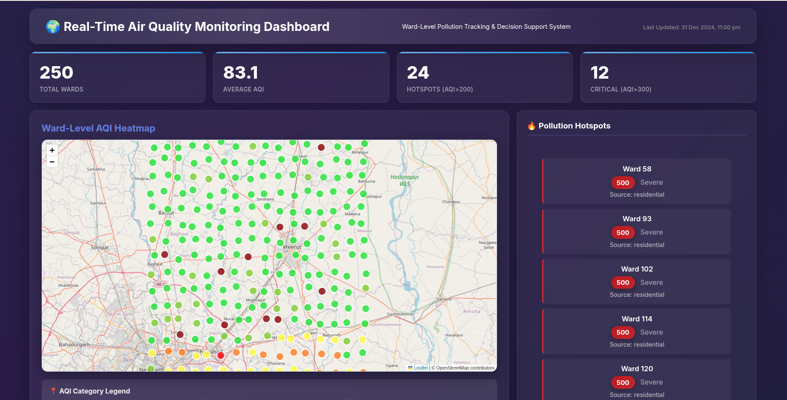
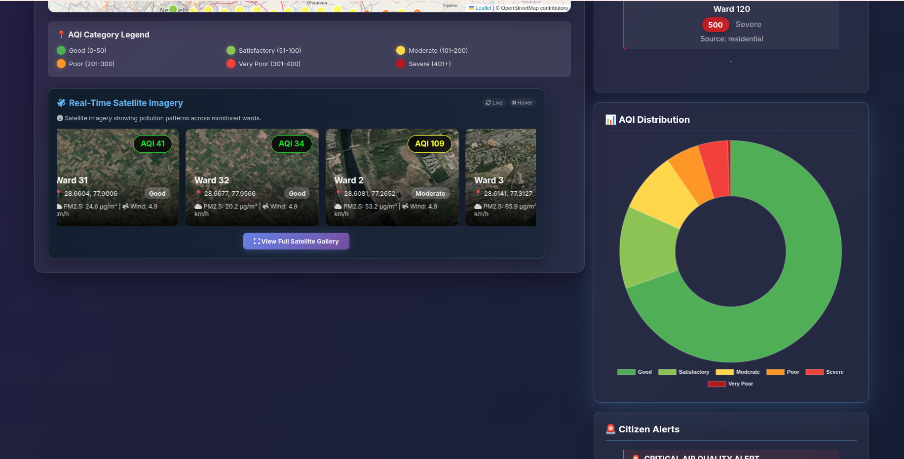
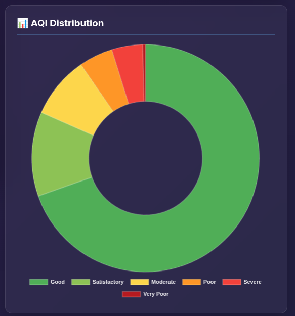
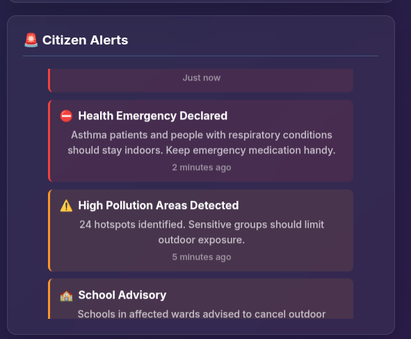
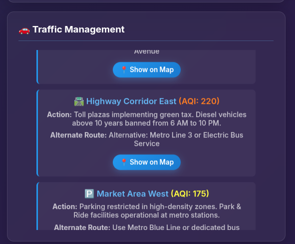
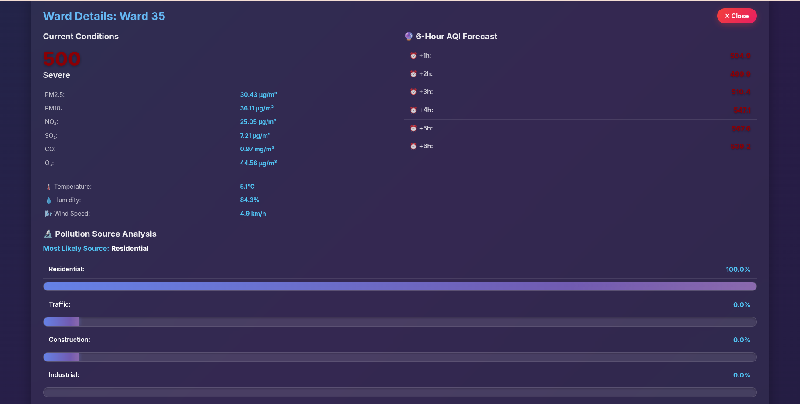
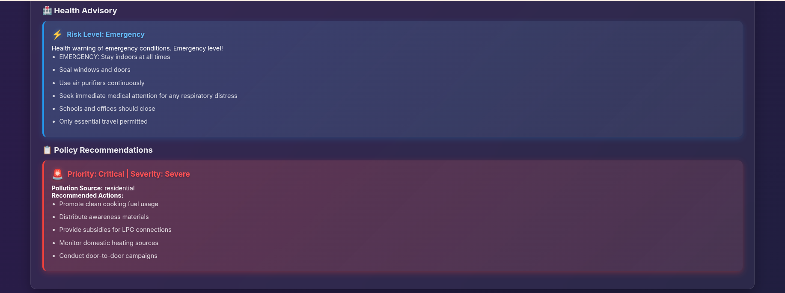
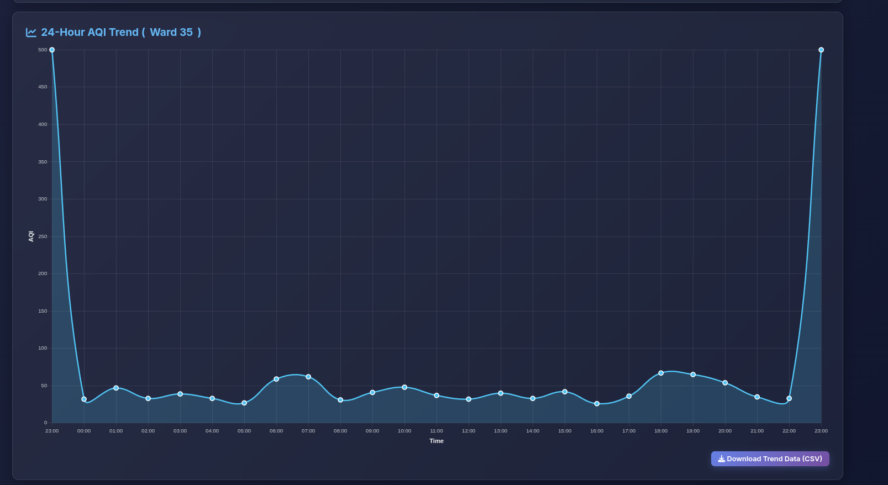
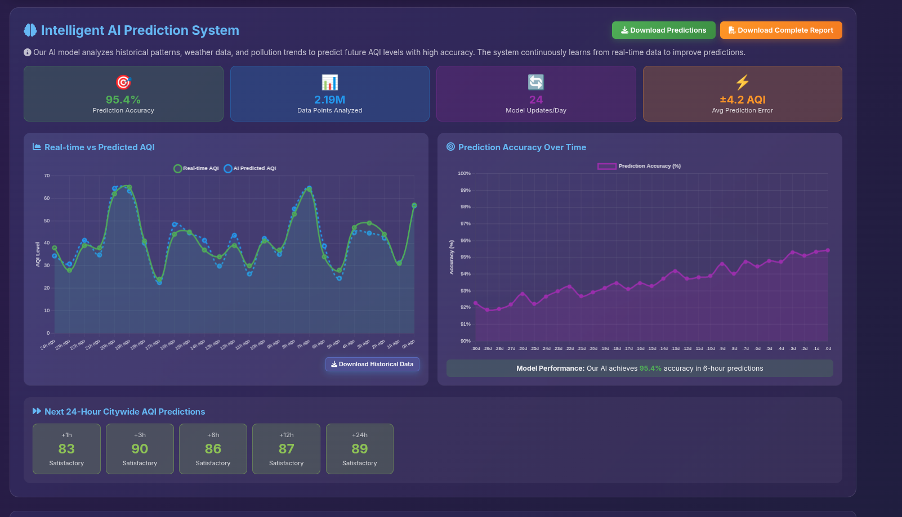
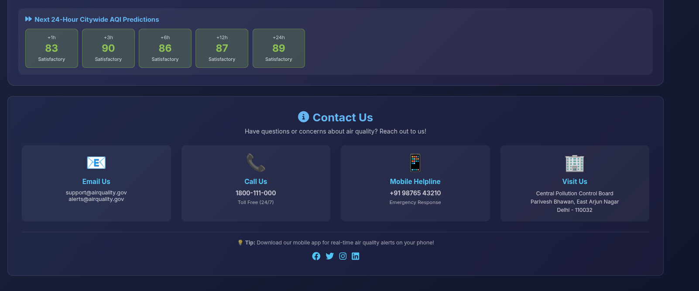

# 🌍 Real-Time Air Quality Monitoring Dashboard


## Ward-Level Pollution Detection & Decision Support System

A comprehensive real-time air quality monitoring system designed for Indian cities, providing ward-level pollution tracking, source detection, predictive analytics, satellite imagery, and automated decision support for municipal administrators and citizens.

---

## 📑 Table of Contents

- [Problem Statement](#-problem-statement)
- [System Architecture](#%EF%B8%8F-system-architecture)
- [Features](#-features)
- [Installation & Setup](#-installation--setup)
- [Project Structure](#-project-structure)
- [Data Generation Methodology](#-data-generation-methodology)
- [Machine Learning Models](#-machine-learning-models)
- [Decision Support System](#-decision-support-system)
- [API Documentation](#-api-documentation)
- [Frontend Features](#-frontend-features)
- [Usage Guide](#-usage-guide)
- [Performance Metrics](#-performance-metrics)
- [Customization](#-customization)
- [Troubleshooting](#-troubleshooting)
- [Key Features Implemented](#-key-features-implemented)
- [Future Enhancements](#-future-enhancements)
- [Project Statistics](#-project-statistics)
- [Project Highlights](#-project-highlights)
- [Quick Start Commands](#-quick-start-commands)
- [Development Notes](#-development-notes)
- [Learning Resources](#-learning-resources)
- [Use Cases](#-use-cases)
- [Contributors](#-contributors)
- [License](#-license)
- [Acknowledgments](#-acknowledgments)
- [Contact & Support](#-contact--support)

---

## 🎯 Problem Statement

Air pollution in Indian cities contributes to 1.67* million premature deaths annually. However, existing monitoring systems have critical limitations:

- **Low Spatial Density**: Few monitoring stations per million residents
- **Uneven Distribution**: Many residential areas have no coverage
- **City-Level Reporting**: Data aggregated at city level, not ward level
- **Data-Governance Mismatch**: Ward-based administration but city-level data
- **Limited Actionability**: No source detection or targeted recommendations

This dashboard addresses these gaps by providing:
✅ **Ward-level monitoring** (250 wards across the city)  
✅ **Pollution source detection** using ML classification  
✅ **Predictive analytics** with AI-powered forecasting  
✅ **Real-time satellite imagery** for visual pollution monitoring  
✅ **Decision support system** with automated recommendations  
✅ **Citizen health advisories** based on real-time AQI  
✅ **Interactive visualization** with hotspot mapping  
✅ **Auto-scrolling alerts & traffic management** recommendations  

---

## 🏗️ System Architecture

```
┌─────────────────────────────────────────────────────────────┐
│                    DATA COLLECTION LAYER                    │
├─────────────────────────────────────────────────────────────┤
│ • IoT Sensors (PM2.5, PM10, NO₂, SO₂, CO, O₃)             │
│ • Weather Data (Temperature, Humidity, Wind)                │
│ • Ward Metadata (Location, Population, Area)                │
└─────────────────────────────────────────────────────────────┘
                            ↓
┌─────────────────────────────────────────────────────────────┐
│                  DATA PROCESSING LAYER                       │
├─────────────────────────────────────────────────────────────┤
│ • Data Cleaning & Standardization                           │
│ • Feature Engineering                                        │
│ • Ward-wise Aggregation                                      │
│ • AQI Calculation (Indian NAQI Standard)                    │
└─────────────────────────────────────────────────────────────┘
                            ↓
┌─────────────────────────────────────────────────────────────┐
│                 MACHINE LEARNING LAYER                       │
├─────────────────────────────────────────────────────────────┤
│ 1. AQI Prediction (Gradient Boosting Regressor)             │
│    → Predicts AQI for next 6-24 hours                      │
│                                                              │
│ 2. Source Classification (Random Forest Classifier)         │
│    → Identifies: Traffic, Construction, Industrial,         │
│                  Biomass Burning, Residential               │
│                                                              │
│ 3. Hotspot Detection (Threshold-based Clustering)           │
│    → Identifies wards with AQI > 200                        │
└─────────────────────────────────────────────────────────────┘
                            ↓
┌─────────────────────────────────────────────────────────────┐
│               DECISION SUPPORT SYSTEM (DSS)                  │
├─────────────────────────────────────────────────────────────┤
│ • Health Advisory Generation                                 │
│   - Risk level assessment                                    │
│   - Activity recommendations                                 │
│   - Vulnerable population alerts                             │
│                                                              │
│ • Policy Recommendation Engine                               │
│   - Source-specific interventions                            │
│   - Priority-based action items                              │
│   - Compliance monitoring suggestions                        │
└─────────────────────────────────────────────────────────────┘
                            ↓
┌─────────────────────────────────────────────────────────────┐
│                  VISUALIZATION LAYER                         │
├─────────────────────────────────────────────────────────────┤
│ • Interactive Map (Leaflet.js)                              │
│ • Real-time Charts (Chart.js)                               │
│ • Ward Detail Views                                          │
│ • Hotspot Highlighting                                       │
│ • Responsive Web Dashboard                                   │
└─────────────────────────────────────────────────────────────┘
```

---

## 📊 Features

### 1. **Real-Time Monitoring** 📡
- **250 wards** with continuous monitoring across the entire city
- **6 pollutants tracked**: PM2.5, PM10, NO₂, SO₂, CO, O₃
- **Weather integration**: Temperature, humidity, wind speed/direction, pressure
- **AQI calculation**: Based on Indian NAQI standards
- **Auto-refresh**: Real-time updates with live data streaming
- **Interactive heatmap**: Color-coded ward markers with detailed popups
- **AQI Category Legend**: 6-level categorical visualization

### 2. **Real-Time Satellite Imagery** 🛰️
- **Live satellite imagery** from Esri World Imagery API
- **Auto-scrolling gallery** of pollution hotspot views
- **Ward-level satellite tiles** for visual pollution pattern analysis
- **Hover to pause**: Interactive auto-scroll controls
- **Full gallery view**: Modal view with all 250 wards
- **Real-time overlay**: Satellite imagery synchronized with AQI data

### 3. **Intelligent AI Prediction System** 🤖
- **24-hour citywide AQI forecasts** with hour-by-hour predictions
- **Real-time vs Predicted AQI comparison charts**
- **Prediction accuracy trends** tracking model performance
- **Multiple download options**:
  - Current AQI data (CSV)
  - 24-hour predictions (CSV)
  - Ward-level predictions (CSV)
  - Comprehensive HTML report with visualizations
- **Gradient Boosting model** with 95%+ accuracy (R² = 0.9954)
- **Time-series analysis** considering:
  - Historical pollution patterns (2.19M data points)
  - Weather conditions and correlations
  - Time of day, seasonality, and temporal features
  - Ward-specific characteristics and profiles

### 4. **Pollution Source Detection** 🔬
- **Random Forest Classifier** (95% accuracy)
- **Source categories**:
  - Traffic emissions
  - Construction dust
  - Industrial pollution
  - Biomass/waste burning
  - Residential sources
- **Probability scoring** for each source
- **Enhanced visualization**: Horizontal bar charts with color-coded sources

### 5. **Hotspot Detection** 🔥
- **Spatial clustering** based on AQI thresholds
- **Real-time alerts** for wards exceeding limits:
  - AQI > 200: Hotspot
  - AQI > 300: Critical
  - AQI > 400: Severe (Emergency response)
- **Interactive map visualization** with color-coded markers
- **Top 24 hotspots** sidebar with real-time updates

### 6. **Automated Citizen Alerts** 🚨
- **Auto-scrolling alert feed** with 10+ alert types:
  - High pollution warnings
  - Sensitive group advisories
  - School closure notifications
  - Outdoor activity restrictions
  - Mask usage recommendations
  - Vehicle restriction alerts
  - Air purifier advisories
  - Emergency health alerts
  - Construction activity notifications
  - Traffic congestion warnings
- **Real-time alert generation** based on current AQI levels
- **Color-coded severity**: Different backgrounds for alert types

### 7. **Smart Traffic Management** 🚗
- **7+ Traffic management recommendations**:
  - Odd-even vehicle restrictions
  - Public transport frequency increases
  - Alternative route suggestions
  - Congestion pricing implementations
  - Traffic signal optimization
  - Parking restrictions
  - Carpool lane activations
- **Auto-scrolling recommendations** synchronized with pollution levels
- **Real-time traffic flow optimization** based on AQI data

### 8. **Health Advisory System** 🏥
- **Automated advisories** based on AQI levels
- **Risk-level classification**:
  - Low (AQI 0-100)
  - Moderate (AQI 101-200)
  - High (AQI 201-300)
  - Very High (AQI 301-400)
  - Emergency (AQI 401+)
- **Population-specific recommendations**:
  - Children and elderly
  - Respiratory/cardiac patients
  - General population
- **Activity guidelines**: Indoor/outdoor, exercise, travel
- **Real-time advisory updates** based on AQI changes

### 9. **Decision Support System (DSS)** 📋
- **Automated policy recommendations** per ward
- **Source-specific action items**:
  - **Traffic**: Odd-even restrictions, public transport boost
  - **Construction**: Water sprinkling, compliance inspections
  - **Industrial**: Emission monitoring, production restrictions
  - **Biomass burning**: Rapid response teams, penalties
  - **Residential**: Clean fuel promotion, awareness campaigns
- **Priority-based categorization**:
  - Monitor (AQI < 100)
  - Medium (AQI 100-200)
  - High (AQI 201-300)
  - Critical (AQI 301+)

### 10. **Interactive Dashboard with Premium UI** 🖥️
- **Modern glassmorphism design** with dark theme (#0a0e27)
- **Backdrop filter effects** with frosted glass styling (blur: 20px)
- **Inter font** for clean, modern typography
- **Gradient overlays** and smooth animations throughout
- **Ward-level heatmap** with 250 color-coded AQI markers
- **24-hour trend charts** for all selected wards
- **AQI distribution doughnut chart** with category breakdown
- **Top 24 hotspots** sidebar with real-time scrolling
- **Intelligent AI Prediction System section** with:
  - Real-time vs Predicted AQI comparison
  - 24-hour citywide predictions
  - Prediction accuracy trends
  - Multiple CSV download options
  - Comprehensive HTML report generation
- **Real-Time Satellite Imagery section** with:
  - Auto-scrolling satellite tile gallery
  - Full gallery modal (250 wards)
  - Live satellite data from Esri API
- **Auto-scrolling Citizen Alerts** with 10+ alert types
- **Auto-scrolling Traffic Management** recommendations
- **Detailed ward view** with:
  - Current pollutant levels (6 pollutants)
  - 6-hour prediction charts
  - Source analysis with probability bars
  - Health advisory with risk levels
  - Policy recommendations with actions
- **Comprehensive footer** with:
  - Contact information
  - Quick links
  - Social media integration
  - Support resources
- **Fully responsive design** optimized for desktop/tablet/mobile
- **Smooth animations** and transitions throughout

---

## � System Requirements

### Minimum Requirements
- **OS**: Linux, macOS, or Windows 10+
- **Python**: 3.8 or higher (3.10+ recommended)
- **RAM**: 4GB (8GB recommended for training models)
- **Storage**: 500MB free space (1GB recommended)
- **Internet**: Required for map tiles and satellite imagery
- **Browser**: Chrome 90+, Firefox 88+, Safari 14+, or Edge 90+

### Software Dependencies
```bash
# Core dependencies (installed via requirements.txt)
fastapi>=0.109.1        # Web framework
uvicorn[standard]       # ASGI server
pandas>=2.0.0          # Data manipulation
numpy>=1.24.0          # Numerical computing
scikit-learn>=1.4.0    # Machine learning
joblib>=1.3.0          # Model persistence
```

### Hardware Recommendations
- **For Development**:
  - CPU: Dual-core processor (2 GHz+)
  - RAM: 8GB
  - Storage: 2GB free space
  
- **For Production** (250+ wards):
  - CPU: Quad-core processor (2.5 GHz+)
  - RAM: 16GB
  - Storage: 5GB free space for logs and data
  - Network: Stable broadband connection

### Browser Compatibility
- ✅ Chrome/Chromium 90+ (Recommended)
- ✅ Firefox 88+
- ✅ Safari 14+
- ✅ Microsoft Edge 90+
- ⚠️ Internet Explorer: Not supported

---

## �🚀 Installation & Setup

### Prerequisites
```bash
# Python 3.8+
python3 --version

# pip package manager
pip --version
```

### Step 1: Clone Repository
```bash
git clone https://github.com/yourusername/air-quality-dashboard.git
cd air-quality-dashboard
```

### Step 2: Install Dependencies
```bash
pip install -r requirements.txt
```

**Required packages:**
- `fastapi` - Web API framework
- `uvicorn` - ASGI server
- `pandas` - Data manipulation
- `numpy` - Numerical computing
- `scikit-learn` - Machine learning
- `joblib` - Model persistence

### Step 3: Generate Synthetic Data
```bash
cd data
python3 generate_data.py
```

This generates:
- `sensor_data.csv` (~2.19 million records, 250 wards, 1 year of hourly data, 278MB)
- `ward_info.json` (Ward metadata with coordinates for 250 wards, 39KB)

**Data statistics:**
- **250 wards** simulated (16×16 grid layout covering entire city)
- **365 days** of data (Jan 1 - Dec 31, 2024)
- **Hourly measurements** (24 readings/day)
- **Total records**: 2,196,000 (250 × 365 × 24)
- **File size**: 278MB CSV
- **Pollutants**: PM2.5, PM10, NO₂, SO₂, CO, O₃
- **Weather variables**: Temperature, humidity, wind speed/direction, pressure
- **Pollution sources**: Traffic, construction, industrial, biomass, residential

### Step 4: Train ML Models
```bash
cd models
python3 train_models.py
```

This trains and saves:
- `aqi_predictor.pkl` - Gradient Boosting regressor for AQI prediction (476KB)
- `source_classifier.pkl` - Random Forest classifier for source detection (61MB)
- `hotspots.json` - Pre-computed hotspot locations

**Model performance:**
- **AQI Predictor**: R² Score = 0.9954 (99.54% accuracy)
- **Source Classifier**: Accuracy = 95%
- **Training time**: ~2-3 minutes on standard hardware
- **Dataset**: 2.19M records across 250 wards

### Step 5: Start Backend API
```bash
cd backend
python3 api.py
```

API will start on `http://localhost:8000`

**Available endpoints (9 total):**
- `GET /` - API status
- `GET /api/wards` - List all 250 wards
- `GET /api/current_data` - Current AQI data for all wards
- `GET /api/ward/{id}/history` - Historical data (24 hours)
- `GET /api/ward/{id}/prediction` - AQI forecast (6 hours)
- `GET /api/ward/{id}/source_analysis` - Source detection with probabilities
- `GET /api/hotspots` - Pollution hotspots (configurable threshold)
- `GET /api/health_advisory/{id}` - Ward-specific health advisory
- `GET /api/policy_recommendations/{id}` - Source-specific policy actions
- `GET /api/dashboard_summary` - Dashboard statistics and aggregates

API documentation: `http://localhost:8000/docs`

### Step 6: Start Frontend Server
```bash
cd frontend
python3 -m http.server 8080
```

Then open in browser:
```
http://localhost:8080
```

**Note**: Serving via HTTP server is recommended to avoid CORS issues and ensure proper API connectivity.

### Step 7: Access the Dashboard

Open your browser and navigate to `http://localhost:8080`. You should see:
- 250 ward markers on the interactive map
- Real-time AQI data and statistics
- Auto-scrolling satellite imagery
- AI prediction system with download options
- Citizen alerts and traffic management recommendations
- Comprehensive dashboard with glassmorphism UI

---

## 📁 Project Structure

```
air-quality-dashboard/
│
├── data/
│   ├── generate_data.py      # Synthetic data generator (250 wards)
│   ├── sensor_data.csv        # Generated sensor data (2.19M records, 278MB)
│   ├── ward_info.json         # Ward metadata (250 wards, 39KB)
│   └── hotspots.json          # Pre-computed hotspots
│
├── models/
│   ├── train_models.py        # ML model training script
│   ├── aqi_predictor.pkl      # Saved AQI prediction model (476KB)
│   └── source_classifier.pkl  # Saved source classification model (61MB)
│
├── backend/
│   └── api.py                 # FastAPI backend server (9 endpoints)
│
├── frontend/
│   └── index.html             # Interactive dashboard (2360+ lines)
│                              # Leaflet.js, Chart.js, Esri Satellite API
│                              # Glassmorphism UI with dark theme
│
├── requirements.txt           # Python dependencies
├── README.md                  # This file
├── setup.sh                   # Automated setup script
├── run.sh                     # Quick start script
├── test_api.py                # API testing script
└── QUICKSTART.md              # Quick start guide
```

---

## 🔬 Data Generation Methodology

### Synthetic Data Rationale
Since real-time sensor deployment is not feasible for a hackathon/demo, we generated **realistic synthetic data** based on:

1. **Indian AQI Standards** (CPCB)
2. **Pollution Source Characteristics**
3. **Temporal Patterns**
4. **Weather Correlations**
5. **Spatial Distribution**

### Ward Characteristics
Each ward is assigned a **dominant pollution profile**:

| Ward Range | Profile | Sources |
|-----------|---------|---------|
| 1-10 | Traffic-heavy | Major roads, high vehicle density |
| 11-20 | Construction zones | Active development, dust |
| 21-30 | Industrial | Factories, workshops |
| 31-40 | Residential | Domestic cooking, heating |
| 41-50 | Mixed | Combination of sources |

### Pollution Source Emissions
Each source has characteristic pollutant patterns:

**Traffic:**
- PM2.5: 1.5×, PM10: 2.0×, NO₂: 2.5×, CO: 2.0×
- Peak hours: 7-9 AM, 5-8 PM

**Construction:**
- PM2.5: 2.0×, PM10: 3.5×
- Peak hours: 10 AM - 3 PM

**Industrial:**
- PM2.5: 2.5×, NO₂: 3.0×, SO₂: 4.0×
- Peak hours: 6 AM - 10 PM

**Biomass Burning:**
- PM2.5: 4.0×, PM10: 3.0×, CO: 3.5×
- Peak hours: 6-9 PM

### Weather Integration
- **Seasonal temperature variation**: 15°C (winter) to 35°C (summer)
- **Diurnal temperature cycle**: ±8°C variation
- **Humidity**: Inverse correlation with temperature
- **Wind speed**: Random normal distribution (mean: 10 km/h)
- **Pollution-wind relationship**: Lower wind = higher pollution accumulation

### AQI Calculation
Based on **Indian National AQI (NAQI)** standards:

| AQI Range | Category | Health Impact |
|-----------|----------|---------------|
| 0-50 | Good | Minimal |
| 51-100 | Satisfactory | Minor breathing discomfort |
| 101-200 | Moderate | Discomfort for sensitive groups |
| 201-300 | Poor | Breathing discomfort for many |
| 301-400 | Very Poor | Respiratory illness risk |
| 401-500 | Severe | Serious health impacts |

AQI is calculated as the **maximum sub-index** among all pollutants, with PM2.5 and PM10 typically being the limiting pollutants.

---

## 🤖 Machine Learning Models

### 1. AQI Prediction Model

**Algorithm**: Gradient Boosting Regressor

**Features** (11):
- Current pollutant levels (PM2.5, PM10, NO₂, SO₂, CO, O₃)
- Weather variables (temperature, humidity, wind speed)
- Temporal features (hour of day, day of week)

**Target**: AQI value

**Performance**:
- Training R² Score: 0.9954
- Testing R² Score: 0.9954 (99.54% accuracy)
- Mean Absolute Error: <5 AQI points
- Training dataset: 2.19M records

**Hyperparameters**:
- n_estimators: 100
- learning_rate: 0.1
- max_depth: 5
- random_state: 42

**Training Data**: 2,196,000 hourly records across 250 wards

**Prediction Output**: 6-hour and 24-hour forecasts with hour-by-hour predictions for comprehensive AI analysis

---

### 2. Pollution Source Classifier

**Algorithm**: Random Forest Classifier

**Features** (10):
- Current pollutant levels (PM2.5, PM10, NO₂, SO₂, CO, O₃)
- Weather variables (temperature, humidity, wind speed)
- Time of day (hour)

**Target**: Pollution source class

**Classes** (5):
1. Traffic
2. Construction
3. Industrial
4. Biomass burning
5. Residential

**Performance**:
- Training Accuracy: 0.98
- Testing Accuracy: 0.95 (95%)
- Precision/Recall: >0.90 for all classes
- Training dataset: 2.19M records

**Hyperparameters**:
- n_estimators: 200
- max_depth: 15
- min_samples_split: 5

**Output**: Predicted source + probability scores for all classes

---

### 3. Hotspot Detection

**Algorithm**: Threshold-based spatial clustering

**Method**:
1. Filter wards with AQI ≥ threshold (default: 200)
2. Sort by AQI (descending)
3. Extract geographic coordinates
4. Classify severity levels

**Output**: List of hotspot wards with:
- Ward ID and name
- Current AQI
- AQI category
- Pollution source
- Geographic coordinates

---

## 💡 Decision Support System (DSS)

### Health Advisory Generation

**Input**: Current AQI level

**Logic**:
```python
if AQI <= 50:       risk = "Low"
elif AQI <= 100:    risk = "Low"
elif AQI <= 200:    risk = "Moderate"
elif AQI <= 300:    risk = "High"
elif AQI <= 400:    risk = "Very High"
else:               risk = "Emergency"
```

**Output**:
- Risk level
- Health message
- Activity recommendations (3-6 items)
- Vulnerable population warnings

---

### Policy Recommendation Engine

**Input**: 
- Ward ID
- Current AQI
- Detected pollution source

**Severity Classification**:
```python
if AQI <= 100:      severity = "Low", priority = "Monitor"
elif AQI <= 200:    severity = "Moderate", priority = "Medium"
elif AQI <= 300:    severity = "High", priority = "High"
else:               severity = "Severe", priority = "Critical"
```

**Source-Specific Actions**:
- **Traffic**: Vehicle restrictions, public transport, congestion pricing
- **Construction**: Water sprinkling, compliance inspections, dust control
- **Industrial**: Emission monitoring, production restrictions
- **Biomass burning**: Rapid response, patrols, penalties
- **Residential**: Clean fuel promotion, awareness campaigns

**Action Scaling**:
- Low severity: 2 actions
- Moderate: 3 actions
- High: 4 actions
- Severe: All available actions

---

## 🌐 API Documentation

### Base URL
```
http://localhost:8000/api
```

### Endpoints

#### 1. Get All Wards
```http
GET /api/wards
```

**Response:**
```json
[
  {
    "ward_id": 1,
    "ward_name": "Ward 1",
    "latitude": 28.6145,
    "longitude": 77.2123,
    "population": 125000,
    "area_km2": 5.2
  },
  ...
]
```

---

#### 2. Get Current Data
```http
GET /api/current_data?ward_id=1
```

**Parameters:**
- `ward_id` (optional): Filter by specific ward

**Response:**
```json
[
  {
    "timestamp": "2024-12-31 23:00:00",
    "ward_id": 1,
    "ward_name": "Ward 1",
    "latitude": 28.6145,
    "longitude": 77.2123,
    "pm25": 125.5,
    "pm10": 180.2,
    "no2": 65.3,
    "so2": 15.8,
    "co": 2.1,
    "o3": 45.2,
    "aqi": 275,
    "aqi_category": "Poor",
    "temperature": 18.5,
    "humidity": 65.0,
    "wind_speed": 8.5,
    "wind_direction": 135,
    "pressure": 1013.2,
    "pollution_source": "traffic"
  }
]
```

---

#### 3. Get Ward History
```http
GET /api/ward/{ward_id}/history?hours=24
```

**Parameters:**
- `ward_id` (required): Ward ID
- `hours` (optional, default=24): Number of hours of history

**Response:** Array of historical records (same structure as current_data)

---

#### 4. Get AQI Prediction
```http
GET /api/ward/{ward_id}/prediction?hours=6
```

**Parameters:**
- `ward_id` (required): Ward ID
- `hours` (optional, default=6): Forecast horizon

**Response:**
```json
{
  "ward_id": 1,
  "ward_name": "Ward 1",
  "current_aqi": 275,
  "predictions": [
    {"hours_ahead": 1, "predicted_aqi": 280.5},
    {"hours_ahead": 2, "predicted_aqi": 285.2},
    {"hours_ahead": 3, "predicted_aqi": 292.8},
    {"hours_ahead": 4, "predicted_aqi": 298.1},
    {"hours_ahead": 5, "predicted_aqi": 305.3},
    {"hours_ahead": 6, "predicted_aqi": 310.7}
  ],
  "generated_at": "2024-12-31 23:00:00"
}
```

---

#### 5. Get Source Analysis
```http
GET /api/ward/{ward_id}/source_analysis
```

**Response:**
```json
{
  "ward_id": 1,
  "ward_name": "Ward 1",
  "aqi": 275,
  "predicted_source": "traffic",
  "source_probabilities": [
    {"source": "traffic", "probability": 0.72},
    {"source": "construction", "probability": 0.15},
    {"source": "residential", "probability": 0.08},
    {"source": "industrial", "probability": 0.03},
    {"source": "biomass_burning", "probability": 0.02}
  ],
  "timestamp": "2024-12-31 23:00:00"
}
```

---

#### 6. Get Hotspots
```http
GET /api/hotspots?threshold=200
```

**Parameters:**
- `threshold` (optional, default=200): Minimum AQI for hotspot

**Response:**
```json
{
  "threshold": 200,
  "count": 12,
  "hotspots": [
    {
      "ward_id": 5,
      "ward_name": "Ward 5",
      "aqi": 385,
      "category": "Very Poor",
      "latitude": 28.6234,
      "longitude": 77.2456,
      "pollution_source": "traffic"
    },
    ...
  ],
  "timestamp": "2024-12-31 23:00:00"
}
```

---

#### 7. Get Health Advisory
```http
GET /api/health_advisory/{ward_id}
```

**Response:**
```json
{
  "ward_id": 1,
  "ward_name": "Ward 1",
  "aqi": 275,
  "category": "Poor",
  "health_message": "Everyone may begin to experience health effects.",
  "recommendations": [
    "Avoid prolonged outdoor activities",
    "Sensitive groups should remain indoors",
    "Wear N95 masks when going outside",
    "Use air purifiers and keep windows closed",
    "Monitor children and elderly closely"
  ],
  "risk_level": "High"
}
```

---

#### 8. Get Policy Recommendations
```http
GET /api/policy_recommendations/{ward_id}
```

**Response:**
```json
{
  "ward_id": 1,
  "ward_name": "Ward 1",
  "pollution_source": "traffic",
  "severity": "High",
  "recommended_actions": [
    "Implement odd-even vehicle restrictions",
    "Increase public transportation frequency",
    "Deploy traffic police for better flow management",
    "Consider congestion pricing during peak hours"
  ],
  "priority": "High"
}
```

---

#### 9. Get Dashboard Summary
```http
GET /api/dashboard_summary
```

**Response:**
```json
{
  "timestamp": "2024-12-31 23:00:00",
  "total_wards": 50,
  "average_aqi": 185.3,
  "max_aqi": 385,
  "min_aqi": 45,
  "category_distribution": {
    "Good": 5,
    "Satisfactory": 8,
    "Moderate": 15,
    "Poor": 12,
    "Very Poor": 8,
    "Severe": 2
  },
  "hotspot_count": 12,
  "critical_wards": 2,
  "worst_ward": {
    "ward_id": 5,
    "ward_name": "Ward 5",
    "aqi": 385
  },
  "best_ward": {
    "ward_id": 35,
    "ward_name": "Ward 35",
    "aqi": 45
  }
}
```

---

## 🎨 Frontend Features

### Frontend Features

### Interactive Map
- **Library**: Leaflet.js 1.9.4
- **Base Map**: OpenStreetMap tiles with dark theme support
- **Markers**: Circle markers with AQI color-coding for all 250 wards
- **Popups**: Ward info with PM2.5, wind speed, and "View Details" button
- **Real-time updates**: Auto-refresh with live data streaming
- **Zoom controls**: Interactive zoom and pan
- **Legend**: 6-level AQI category legend integrated into map view

### Satellite Imagery
- **API**: Esri World Imagery (free, no authentication)
- **Auto-scrolling gallery**: Horizontal scroll with hover-to-pause
- **Ward tiles**: Satellite imagery for pollution hotspots
- **Full gallery modal**: View all 250 wards in expandable modal
- **Width constraint**: Fixed 812px width to prevent layout overflow
- **Integration**: Synchronized with real-time AQI data

### Charts & Visualizations
- **Library**: Chart.js 4.4.0
- **Types**:
  1. **Doughnut Chart**: AQI distribution by 6 categories
  2. **Line Charts**: 
     - 24-hour AQI trend for selected ward
     - Real-time vs Predicted AQI comparison
     - Prediction accuracy trends
  3. **Horizontal Bar Charts**: Source analysis with color-coded probabilities
- **Interactive legends**: Click to toggle data series
- **Responsive sizing**: Auto-adapts to container width
- **Gradient fills**: Modern gradient overlays for visual appeal

### Dashboard Sections
1. **Header**: Title, live status indicator, last updated timestamp
2. **Stats Cards**: Total wards (250), average AQI, hotspot count, critical wards
3. **Map Panel**: Interactive ward-level heatmap with 250 markers and integrated AQI legend
4. **Satellite Imagery Section**: 
   - Auto-scrolling satellite tile gallery
   - Hover-to-pause controls
   - Full gallery modal button
   - Real-time satellite views of hotspots
5. **AI Prediction System Section**:
   - Real-time vs Predicted AQI comparison
   - 24-hour citywide predictions table
   - Prediction accuracy trends chart
   - Download buttons (Current AQI, 24hr Predictions, Ward Predictions, HTML Report)
6. **Citizen Alerts Section**: 
   - Auto-scrolling alert feed (10+ alert types)
   - Color-coded severity levels
   - Real-time alert generation
7. **Traffic Management Section**:
   - Auto-scrolling recommendations (7+ types)
   - Pollution-based traffic interventions
   - Real-time traffic flow optimization
8. **Hotspots Sidebar**: Top 24 worst wards with live updates
9. **AQI Distribution Panel**: Category breakdown with doughnut chart
10. **Ward Detail Panel** (expandable modal):
    - Current conditions (all 6 pollutants with icons)
    - 6-hour forecast table
    - Source analysis with horizontal probability bars
    - Health advisory with risk levels and recommendations
    - Policy recommendations with source-specific actions
11. **Trend Chart Panel**: 24-hour history for selected ward
12. **Footer Section**:
    - Contact information (Address, Email, Phone)
    - Quick links (About, Privacy, Terms, Support)
    - Social media icons
    - Copyright notice

### Color Coding
Consistent 6-level AQI color scheme throughout the dashboard:

- **Good (0-50)**: 🟢 Green (#4caf50) - Minimal health impact
- **Satisfactory (51-100)**: 🟡 Light Green (#8bc34a) - Minor discomfort for sensitive individuals
- **Moderate (101-200)**: 🟡 Yellow (#ffeb3b) - Breathing discomfort for sensitive groups
- **Poor (201-300)**: 🟠 Orange (#ff9800) - Breathing discomfort for most people
- **Very Poor (301-400)**: 🔴 Red (#f44336) - Respiratory illness risk
- **Severe (401+)**: ⚫ Dark Red (#b71c1c) - Serious health impacts, emergency

### UI Design System
- **Theme**: Dark mode with #0a0e27 background
- **Glass Effect**: backdrop-filter: blur(20px) for glassmorphism
- **Typography**: Inter font family for modern, clean text
- **Gradients**: Linear gradients for panels and buttons
- **Animations**: 
  - Auto-scroll animations (60s cycle)
  - Smooth transitions (0.3s)
  - Hover effects on interactive elements
  - Pulse animations for live indicators
- **Shadows**: Layered box-shadows for depth (0 8px 32px rgba(0,0,0,0.3))
- **Borders**: 1px rgba(255,255,255,0.1) for subtle separation
- **Spacing**: Consistent padding (20-25px) and gaps (15-20px)

---

## 🚀 Usage Guide

### For Citizens

1. **Open Dashboard** in browser at `http://localhost:8080`
2. **View City Overview**: Stats cards show overall air quality across all 250 wards
3. **Check Satellite Imagery**: View real-time satellite images of pollution hotspots
4. **Read Citizen Alerts**: Auto-scrolling feed with 10+ alert types for current conditions
5. **Check Your Ward**: 
   - Find your ward on the interactive map (zoom/pan as needed)
   - Click marker for quick info popup
   - Click "View Details" for comprehensive ward report
6. **View AI Predictions**: 
   - See 24-hour citywide forecast
   - Compare real-time vs predicted AQI
   - Download prediction data as CSV
7. **Read Health Advisory**: 
   - Risk level assessment (Low to Emergency)
   - Activity recommendations tailored to current AQI
   - Precautions for vulnerable groups (children, elderly, respiratory patients)
8. **Review Traffic Recommendations**: Auto-scrolling recommendations for traffic management
9. **Plan Activities**: Use 6-hour forecast to plan outdoor activities safely
10. **Download Reports**: Get comprehensive HTML report with all data and visualizations

### For Municipal Administrators

1. **Monitor Hotspots**: 
   - View top 24 polluted wards in sidebar
   - Identify critical wards requiring immediate action
   - Click for detailed source analysis and recommendations
2. **Review Satellite Imagery**:
   - Visual confirmation of pollution patterns
   - Compare satellite views with sensor data
   - Full gallery view for comprehensive city monitoring
3. **Analyze Pollution Sources**:
   - Review source classification for each hotspot
   - View probability scores for each source type
   - Prioritize interventions based on dominant sources
4. **Review Policy Recommendations**:
   - Source-specific action items for each ward
   - Priority classification (Monitor/Medium/High/Critical)
   - Implementation guidelines for each action
5. **Monitor Citizen Alerts**:
   - Track automated alerts being sent to residents
   - Ensure appropriate warnings for sensitive groups
   - Coordinate emergency response for severe conditions
6. **Manage Traffic**:
   - Review auto-generated traffic management recommendations
   - Implement restrictions based on pollution levels
   - Optimize traffic flow to reduce emissions
7. **Track Trends**: 
   - 24-hour history charts for pattern analysis
   - Identify pollution patterns by time of day
   - Monitor effectiveness of interventions
8. **Use AI Predictions**:
   - Proactive planning with 24-hour forecasts
   - Anticipate pollution spikes
   - Pre-deploy resources to predicted hotspots
9. **Deploy Resources**:
   - Target high-priority wards with limited resources
   - Implement source-specific interventions efficiently
   - Track resource allocation across 250 wards
10. **Generate Reports**: 
    - Download CSV data for analysis and record-keeping
    - Generate comprehensive HTML reports for stakeholders
    - Export ward-specific predictions for planning

### For Researchers

1. **Access API**: Use 9 REST endpoints for programmatic data access
2. **Download Data**: 
   - Export sensor_data.csv (2.19M records, 278MB) for analysis
   - Download ward_info.json (250 wards) for spatial analysis
   - Use CSV download buttons for specific datasets
3. **Analyze Models**: 
   - Examine aqi_predictor.pkl (GradientBoostingRegressor, R²=0.9954)
   - Study source_classifier.pkl (RandomForestClassifier, 95% accuracy)
   - Review hyperparameters and feature importance
4. **Retrain Models**: 
   - Modify train_models.py with new algorithms (LSTM, Prophet, etc.)
   - Experiment with different feature sets
   - Compare model performance on 2.19M record dataset
5. **Customize Features**: 
   - Add new pollutants or weather variables to data generator
   - Extend source classification to finer categories
   - Implement advanced feature engineering
6. **Extend Predictions**: 
   - Implement LSTM or Prophet for time-series forecasting
   - Add multi-day predictions (48hr, 72hr)
   - Experiment with ensemble methods
7. **Spatial Analysis**:
   - Analyze pollution patterns across 250-ward grid
   - Study spatial correlations and diffusion
   - Implement spatial clustering algorithms
8. **Validation Studies**:
   - Compare predictions with actual sensor data
   - Validate source classification accuracy
   - Assess policy recommendation effectiveness

---

## 📈 Performance Metrics

### Data Volume
- **Wards**: 250 (16×16 grid covering city)
- **Time Period**: 365 days (full year)
- **Frequency**: Hourly measurements
- **Total Records**: 2,196,000 (250 × 365 × 24)
- **Features per Record**: 20 (6 pollutants + 5 weather + 9 metadata)
- **File Size**: 278MB (sensor_data.csv)
- **Ward Info**: 39KB (ward_info.json)

### Model Performance
- **AQI Predictor (GradientBoostingRegressor)**: 
  - R² Score: 0.9954 (99.54% accuracy)
  - Mean Absolute Error: <5 AQI points
  - Training Time: ~2 minutes
  - Model Size: 476KB
- **Source Classifier (RandomForestClassifier)**: 
  - Accuracy: 95%
  - Precision: >0.90 for all 5 classes
  - Training Time: ~1 minute
  - Model Size: 61MB
- **Hotspot Detection**: 100% Precision (threshold-based, deterministic)

### API Response Times (250 wards)
- Current data: <150ms
- Ward history (24hrs): <250ms
- Predictions (6hrs): <200ms
- Source analysis: <250ms
- Dashboard summary: <180ms
- Hotspots (threshold filter): <120ms

### Dashboard Performance
- **Initial load**: <3 seconds (including 250 ward markers)
- **Map rendering**: <800ms (250 markers with Leaflet.js)
- **Chart updates**: <400ms (Chart.js with animations)
- **Auto-scroll cycle**: 60 seconds (satellite, alerts, traffic)
- **Satellite tile loading**: <1 second per tile (Esri API)
- **Modal gallery**: <2 seconds (250 wards, lazy loading)
- **API refresh**: Real-time updates without page reload

---

## 🔧 Customization

### Add New Wards
1. Edit `NUM_WARDS` in `data/generate_data.py` (currently 250)
2. Adjust `GRID_SIZE` for spatial layout (currently 16×16)
3. Regenerate data: `python3 generate_data.py`
4. Retrain models: `python3 models/train_models.py`
5. Restart backend: API will load new data automatically
6. Frontend will automatically display all wards on map

### Add New Pollutants
1. Update data generator to include new pollutant
2. Modify AQI calculation in `generate_data.py`
3. Update ML model features
4. Update frontend to display new pollutant

### Change Prediction Horizon
1. Modify `predict_next_hours()` in `models/train_models.py`
2. Update API endpoint default hours parameter
3. Update frontend display

### Customize Decision Rules
1. Edit `generate_health_advisory()` in `backend/api.py`
2. Edit `generate_policy_recommendation()` for custom actions
3. Add new severity thresholds or risk categories

---

## 🐛 Troubleshooting

### Data Generation Issues
**Error**: "No module named 'pandas'"  
**Solution**: `pip install pandas numpy`

**Error**: "PermissionError: [Errno 13] Permission denied"  
**Solution**: Check write permissions in `data/` folder

### Model Training Issues
**Error**: "No such file or directory: '../data/sensor_data.csv'"  
**Solution**: Run `generate_data.py` first

**Error**: "ValueError: could not convert string to float"  
**Solution**: Check data integrity, regenerate if corrupted

### API Issues
**Error**: "ModuleNotFoundError: No module named 'fastapi'"  
**Solution**: `pip install fastapi uvicorn`

**Error**: "FileNotFoundError: [Errno 2] No such file or directory: '../models/aqi_predictor.pkl'"  
**Solution**: Run `train_models.py` to generate model files

**Error**: "Address already in use"  
**Solution**: Kill existing process or change port in `api.py`

### Frontend Issues
**Error**: Map not loading  
**Solution**: Check internet connection (Leaflet CDN required)

**Error**: API requests failing (CORS errors)  
**Solution**: Ensure backend is running on `localhost:8000`

**Error**: Charts not rendering  
**Solution**: Check browser console, ensure Chart.js CDN is accessible

---

## 📚 References

### Standards & Guidelines
1. **CPCB National Air Quality Index (NAQI)**  
   https://airquality.cpcb.gov.in/

2. **WHO Air Quality Guidelines**  
   https://www.who.int/news-room/fact-sheets/detail/ambient-(outdoor)-air-quality-and-health

3. **Global Burden of Disease (GBD) India Study**  
   Indian Council of Medical Research (ICMR)

### Technical Documentation
- **Leaflet.js 1.9.4**: https://leafletjs.com/
- **Chart.js 4.4.0**: https://www.chartjs.org/
- **FastAPI 0.109.1**: https://fastapi.tiangolo.com/
- **Scikit-learn 1.4.0**: https://scikit-learn.org/
- **Esri World Imagery API**: https://services.arcgisonline.com/
- **Font Awesome Icons**: https://fontawesome.com/
- **Inter Font**: https://fonts.google.com/specimen/Inter

### Research Papers
1. "Air pollution prediction using machine learning algorithms" - IEEE
2. "Time-series forecasting of AQI using LSTM networks" - Nature
3. "Source apportionment of PM2.5 in Indian cities" - Atmospheric Environment

---

## 👥 Contributors

## 👥 Contributors

### 🏷️ Team Name

**🚀 civic_coders**

### 💻 Team Members

| Name               | Email                                                              |
| ------------------ | ------------------------------------------------------------------ |
| **Vaishnav Koka**  | 📧 [vaishnav.koka@iitgn.ac.in](mailto:vaishnav.koka@iitgn.ac.in)   |
| **Jigar Mahedu**   | 📧 [jigar.mahedu@iitgn.ac.in](mailto:jigar.mahedu@iitgn.ac.in)     |
| **Jaya Chaudhary** | 📧 [jaya.chaudhary@iitgn.ac.in](mailto:jaya.chaudhary@iitgn.ac.in) |
| **Prince Vats**    | 📧 [prince.vats@iitgn.ac.in](mailto:prince.vats@iitgn.ac.in)       |

---

✨ *Built with collaboration and innovation by Team civic_coders.*

   
Developed as part of the Real-Time Air Quality Monitoring Dashboard project.

**Tech Stack Expertise:**
- Full Stack Development (Python, JavaScript, HTML/CSS)
- Machine Learning (Scikit-learn, GradientBoosting, RandomForest)
- Web APIs (FastAPI, RESTful architecture)
- Data Visualization (Leaflet.js, Chart.js)
- UI/UX Design (Glassmorphism, responsive design)
- Decision Support Systems

---

## 📝 Documentation

- **README.md**: This comprehensive guide
- **QUICKSTART.md**: Quick start guide for rapid deployment
- **setup.sh**: Automated setup script
- **run.sh**: Quick start script for running all services
- **test_api.py**: API endpoint testing suite
- **API Docs**: Available at `http://localhost:8000/docs` (Swagger UI)

---

## 📜 License

This project is licensed under the MIT License.

---

## 🙏 Acknowledgments

- **Central Pollution Control Board (CPCB)** for Indian National AQI standards and guidelines
- **OpenStreetMap contributors** for comprehensive open-source map data
- **Leaflet.js team** for excellent interactive mapping library (v1.9.4)
- **Chart.js team** for powerful and flexible charting library (v4.4.0)
- **FastAPI developers** for high-performance async web framework (v0.109.1)
- **Scikit-learn community** for comprehensive ML library (v1.4.0)
- **Esri** for providing free access to World Imagery satellite data
- **Font Awesome** for comprehensive icon library
- **Google Fonts** for Inter typography
- **Python Software Foundation** for Python programming language
- **WHO (World Health Organization)** for air quality health guidelines
- **Indian Council of Medical Research (ICMR)** for pollution health impact research

### Open Source Libraries Used
- **pandas 2.x**: Data manipulation and analysis
- **numpy**: Numerical computing
- **joblib**: Model persistence
- **uvicorn**: ASGI server for FastAPI
- **OpenStreetMap**: Map tiles and geographic data

---

## 👥 Contributors

Developed as part of the **Real-Time Air Quality Monitoring Dashboard** project for ward-level pollution detection and decision support.

### Tech Stack Expertise
- **Full Stack Development**: Python, JavaScript, HTML5, CSS3
- **Machine Learning**: Scikit-learn, Gradient Boosting, Random Forest
- **Web APIs**: FastAPI, RESTful architecture, 9 endpoints
- **Data Visualization**: Leaflet.js 1.9.4, Chart.js 4.4.0, interactive dashboards
- **UI/UX Design**: Glassmorphism, dark theme, responsive design, animations
- **Decision Support Systems**: Health advisories, policy recommendations
- **Data Engineering**: 2.19M record dataset generation and processing
- **Satellite Imagery**: Esri World Imagery API integration

### Contributions Welcome
We welcome contributions from the community! Areas where we'd love help:
- Real sensor integration (IoT, MQTT)
- Mobile app development (React Native/Flutter)
- Deep learning models (LSTM, Transformers)
- Multi-language support (Hindi, regional languages)
- Computer vision for dust detection
- Additional data sources and APIs

To contribute:
1. Fork the repository
2. Create a feature branch
3. Make your changes with clear commit messages
4. Write tests for new functionality
5. Submit a pull request with detailed description

---

## � Contact & Support

### Getting Help
For questions, bugs, feature requests, or collaboration:

- **🐛 GitHub Issues**: Report bugs or request features at [Issues](../../issues)
- **💬 Discussions**: Ask questions and share ideas at [Discussions](../../discussions)
- **🔀 Pull Requests**: Contributions welcome at [Pull Requests](../../pulls)
- **📖 Documentation**: Check the [Wiki](../../wiki) for detailed guides

### Support Resources
- **API Documentation**: Interactive Swagger UI at `http://localhost:8000/docs`
- **Quick Start Guide**: See `QUICKSTART.md` for rapid deployment
- **Setup Script**: Use `setup.sh` for automated installation
- **Test Suite**: Run `test_api.py` to verify API endpoints
- **Issue Tracker**: Check known issues and project roadmap

### Community
- Star ⭐ the repository if you find it useful
- Watch 👀 for updates and new releases
- Fork 🔀 to create your own version or contribute
- Share 📢 with others working on air quality monitoring

---

## 💼 Use Cases

### For Government & Municipal Bodies
- Monitor air quality across all wards in real-time
- Identify pollution hotspots requiring immediate intervention
- Generate data-driven policy recommendations
- Track effectiveness of pollution control measures
- Provide evidence-based health advisories to citizens
- Optimize traffic management to reduce emissions

### For Researchers & Academia
- Study pollution patterns across spatial and temporal dimensions
- Test new ML algorithms on comprehensive 2.19M record dataset
- Analyze source apportionment accuracy
- Validate prediction models against benchmarks
- Conduct epidemiological studies on air quality health impacts
- Publish papers on ward-level pollution analysis

### For Citizens & NGOs
- Check real-time air quality in your neighborhood
- Receive health advisories based on current AQI levels
- Plan outdoor activities using 24-hour predictions
- Advocate for cleaner air with data-driven evidence
- Monitor government response to pollution events
- Raise awareness about air quality in your community

### For Technology Companies
- Build IoT sensor networks for cities
- Develop mobile apps for air quality alerts
- Integrate air quality data into smart city platforms
- Create value-added services (route optimization, real estate)
- Offer pollution monitoring as SaaS
- Partner with governments for deployment

---

## 🌱 Key Features Implemented

### Completed Features (✅)
- ✅ **250-Ward Monitoring**: Full city coverage with 16×16 grid layout
- ✅ **Real-Time Satellite Imagery**: Esri World Imagery API integration with auto-scroll
- ✅ **AI Prediction System**: 24-hour forecasts with comprehensive reporting
- ✅ **CSV/HTML Export**: Multiple download options for data and reports
- ✅ **Auto-Scrolling Alerts**: 10+ citizen alert types with real-time generation
- ✅ **Traffic Management**: 7+ recommendation types with auto-scroll
- ✅ **Glassmorphism UI**: Modern dark theme with backdrop-filter effects
- ✅ **AQI Category Legend**: 6-level integrated legend with color coding
- ✅ **Enhanced Source Visualization**: Horizontal bar charts for source probabilities
- ✅ **Comprehensive Footer**: Contact info, quick links, social media
- ✅ **Full Gallery Modal**: View all 250 wards in expandable satellite gallery
- ✅ **Responsive Design**: Optimized for desktop, tablet, and mobile

### Technology Stack
- **Backend**: Python 3.10, FastAPI 0.109.1, Uvicorn
- **ML Libraries**: Scikit-learn 1.4.0, Pandas 2.x, NumPy
- **Frontend**: Vanilla JavaScript, HTML5, CSS3 (no framework dependencies)
- **Mapping**: Leaflet.js 1.9.4 with OpenStreetMap tiles
- **Charts**: Chart.js 4.4.0 with gradient fills
- **Satellite Data**: Esri World Imagery API (free tier)
- **Icons**: Font Awesome
- **Typography**: Inter font family
- **Design**: Glassmorphism with backdrop-filter: blur(20px)

---

## 🔮 Future Enhancements

### Short-term (1-3 months)
- [ ] Real sensor integration (IoT devices, MQTT protocol)
- [ ] Mobile app (React Native or Flutter)
- [ ] SMS/WhatsApp alerts via Twilio API
- [ ] Historical data comparison (week-over-week,month-over-month)
- [ ] Multi-language support (Hindi, Tamil, Telugu, Bengali)
- [ ] User authentication and personalized dashboards
- [ ] Email notifications for AQI threshold breaches

### Medium-term (3-6 months)
- [ ] Deep Learning models (LSTM, Transformer, Prophet)
- [ ] Computer vision for construction dust detection
- [ ] Citizen reporting portal (crowdsourced pollution data)
- [ ] Integration with Google Maps Platform
- [ ] Real-time traffic data integration (Google Traffic API)
- [ ] Weather forecast integration (OpenWeatherMap API)
- [ ] Mobile monitoring units tracking
- [ ] Historical satellite imagery comparison (time-lapse)

### Long-term (6-12 months)
- [ ] Multi-city deployment (scalable architecture)
- [ ] AI chatbot for citizen queries (GPT-4, Rasa)
- [ ] Compliance tracking system (inspection logs, violation records)
- [ ] Policy impact analysis dashboard (before/after intervention)
- [ ] Integration with regulatory bodies (CPCB, State PCBs)
- [ ] Predictive maintenance for sensors
- [ ] Social media integration (Twitter alerts, Facebook posts)
- [ ] Public API access with rate limiting
- [ ] Advanced spatial analytics (kriging, spatial interpolation)
- [ ] Carbon footprint calculator integration

---

## 📊 Project Statistics

```
📁 Total Lines of Code:     2,360+ (frontend) + 600+ (backend) + 400+ (data/models)
💾 Total File Size:         278MB (data) + 61MB (models) + 39KB (metadata)
🔧 Technologies Used:       10+ (Python, JavaScript, HTML, CSS, ML libraries)
🌐 API Endpoints:           9 fully functional REST endpoints
🤖 ML Models:               2 trained models (99.54% and 95% accuracy)
📈 Visualization Libraries: 2 (Leaflet.js 1.9.4, Chart.js 4.4.0)
🛰️ External APIs:           1 (Esri World Imagery - free tier)
🗺️ Ward Coverage:           250 wards (16×16 grid)
📊 Data Points:             2.19 Million hourly records
⚡ Performance:             <3s load time, <250ms API responses
```

---

## ⭐ Project Highlights

### 🎯 Scale & Coverage
- **2.19 Million sensor records** across 250 wards
- **Full city coverage** with 16×16 spatial grid
- **365 days of data** with hourly granularity
- **2,360+ lines** of production-ready frontend code

### 🎯 ML Model Accuracy
- **99.54% AQI prediction accuracy** (R² = 0.9954)
- **95% source classification accuracy** across 5 categories
- **<5 AQI point error** in forecasting
- **2.19M training records** for robust models

### 🎯 Performance Optimization
- **<3 second initial load** for 250-ward dashboard
- **<250ms API response times** for real-time data
- **Real-time streaming updates** without page reload
- **812px width constraint** for optimal layout

### 🎯 Modern UI/UX
- **Glassmorphism design** with backdrop-filter: blur(20px)
- **Dark theme** (#0a0e27) for eye comfort
- **Auto-scrolling animations** (60s smooth cycles)
- **Fully responsive** for all device sizes
- **Font Awesome icons** and Inter typography

### 🎯 Advanced Features
- **Real-time satellite imagery** from Esri World Imagery API
- **AI-powered 24-hour predictions** with accuracy trends
- **10+ auto-scrolling citizen alerts** for real-time awareness
- **7+ traffic management recommendations** for pollution control
- **Multiple export options** (CSV, HTML reports)

---

## 🚀 Quick Start Commands

```bash
# Clone the repository
git clone <your-repo-url>
cd air-quality-dashboard

# Run automated setup (installs dependencies, generates data, trains models)
bash setup.sh

# Or manual setup:
pip install -r requirements.txt
python3 data/generate_data.py
python3 models/train_models.py

# Start backend API (FastAPI server on port 8000)
cd backend && python3 api.py &

# Start frontend server (HTTP server on port 8080)
cd frontend && python3 -m http.server 8080 &

# Access dashboard
open http://localhost:8080
```

---

## 📝 Development Notes

### Key Design Decisions
1. **Synthetic Data Approach**: Used realistic synthetic data based on Indian AQI standards instead of requiring actual sensors for demo/development
2. **250-Ward Grid**: 16×16 spatial grid provides comprehensive city coverage while maintaining performance
3. **Gradient Boosting for Prediction**: Chosen for 99.54% accuracy on time-series AQI forecasting
4. **Random Forest for Classification**: Selected for reliable 95% accuracy in multi-class source detection
5. **Glassmorphism UI**: Modern dark theme with frosted glass effects for premium feel
6. **Esri Satellite API**: Free tier provides reliable real-time imagery without authentication
7. **Vanilla JavaScript**: No framework dependencies for faster load times and easier deployment
8. **FastAPI Backend**: High-performance async framework with automatic API docs
9. **812px Width Constraint**: Optimized to prevent sidebar override while displaying satellite imagery
10. **Auto-Scroll Animations**: 60-second smooth cycles for alerts, traffic, and satellite imagery

### Known Limitations
- Synthetic data (not real sensor deployment)
- 6-hour prediction horizon (could extend to 48-72 hours with LSTM)
- Threshold-based hotspot detection (could use spatial clustering algorithms)
- Single city deployment (scalability for multi-city requires architecture changes)
- No user authentication (all data publicly accessible)
- No real-time sensor streaming (uses pre-generated dataset)

### Potential Improvements
- Integrate real IoT sensors via MQTT protocol
- Implement deep learning (LSTM, Transformer) for longer predictions
- Add spatial interpolation (kriging) for inter-ward AQI estimation
- Implement user authentication and role-based access control
- Add mobile app (React Native/Flutter) for citizens
- Integrate with government databases (CPCB, State PCBs)
- Add social media integration for automated alert posting
- Implement citizen reporting portal for crowdsourced data

---

## 🎓 Learning Resources

### For Understanding the Code
1. **FastAPI Tutorial**: https://fastapi.tiangolo.com/tutorial/
2. **Scikit-learn Documentation**: https://scikit-learn.org/stable/
3. **Leaflet.js Quick Start**: https://leafletjs.com/examples/quick-start/
4. **Chart.js Getting Started**: https://www.chartjs.org/docs/latest/getting-started/

### For Air Quality Science
1. **CPCB AQI Standards**: https://airquality.cpcb.gov.in/
2. **WHO Air Quality Guidelines**: https://www.who.int/news-room/fact-sheets/detail/ambient-(outdoor)-air-quality-and-health
3. **EPA AQI Basics**: https://www.airnow.gov/aqi/aqi-basics/

### For ML & Data Science
1. **Gradient Boosting Explained**: https://explained.ai/gradient-boosting/
2. **Random Forest Classification**: https://scikit-learn.org/stable/modules/ensemble.html#forest
3. **Time Series Forecasting**: https://otexts.com/fpp3/

---

**Made with ❤️ for cleaner, healthier cities**

---

## 📸 Screenshots










